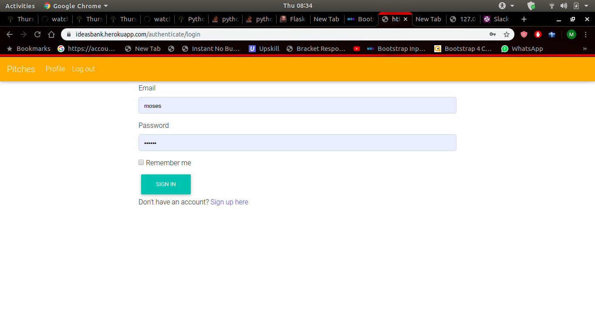
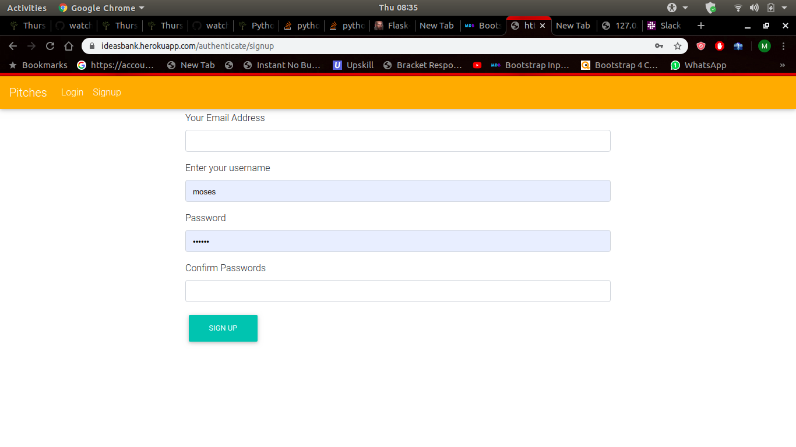
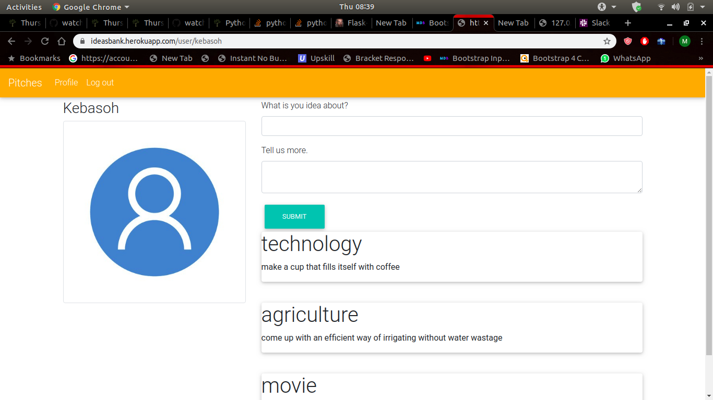

#                News Highlights

An application where people make one minute pitches 

## Created by [wamakimaN](https://github.com/wamakimaN)

## Description

It allows users to see pitches made by other users and make pitches too.
Users create profiles if they dont have one already.
Users have the option of making a pitch or just view pitches from other users.

## B.D.D

* landing page

this is the first page a user sees

---

* Login page.

users sign in here if they have an account.

---

* Signup page.

if one does not have a profile they make one here

---

* Profile page.

users can now view pitches after login.

---

## link

You can use the app [here](https://newhig.herokuapp.com/)

## Installation

Clone this using the command below on your terminal:

$ git clone  https://github.com/wamakimaN/movie-list.git

## Technologies Used

* Python 3.6
* Dependencies :
alembic==1.3.2
autopep8==1.4.4
blinker==1.4
Click==7.0
dominate==2.4.0
Flask==1.1.1
Flask-Bootstrap==3.3.7.1
Flask-Login==0.4.1
Flask-Mail==0.9.1
Flask-Migrate==2.5.2
Flask-Script==2.0.6
Flask-SQLAlchemy==2.4.1
Flask-Uploads==0.2.1
Flask-WTF==0.14.2
gunicorn==20.0.4
itsdangerous==1.1.0
Jinja2==2.10.3
Mako==1.1.0
MarkupSafe==1.1.1
psycopg2==2.8.4
pycodestyle==2.5.0
python-dateutil==2.8.1
python-editor==1.0.4
six==1.13.0
SQLAlchemy==1.3.12
visitor==0.1.3
Werkzeug==0.16.0
WTForms==2.2.1

* install python and the above dependencies.
* run application by the command "./start.sh" in the terminal.

## Known bugs

there are no known bugs at the moment.

## License

MIT (C) **[wamakimaN](https://github.com/wamakimaN)**